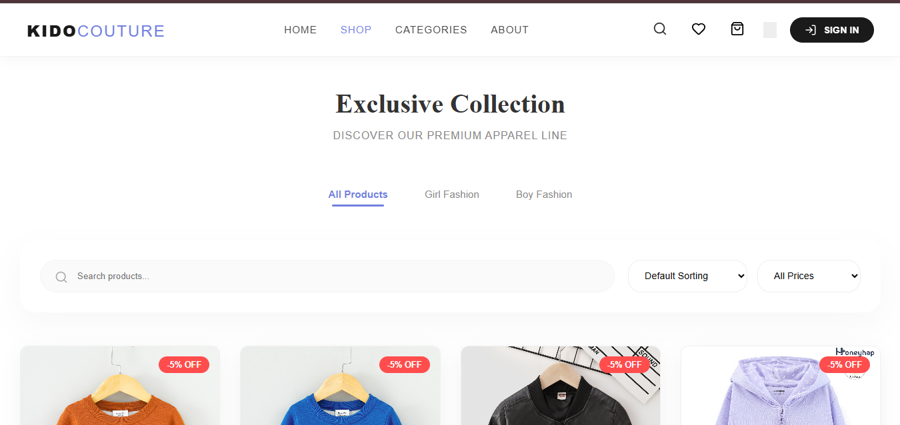
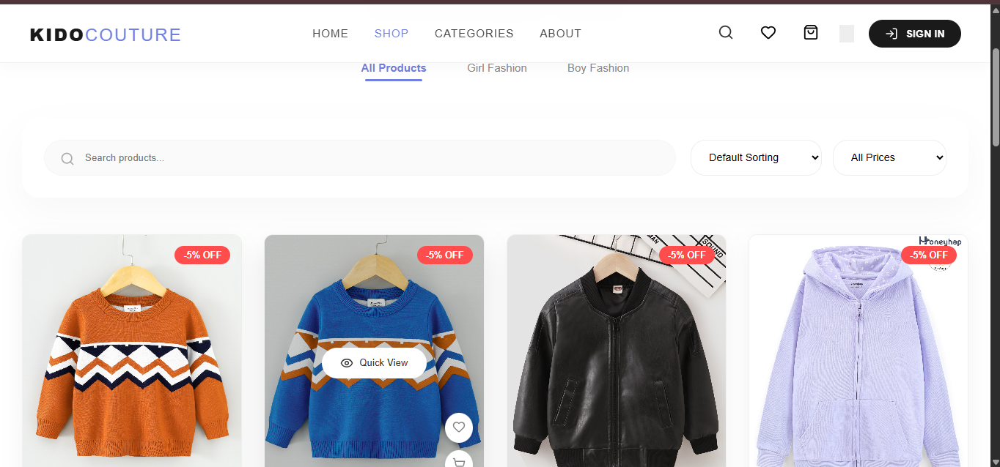
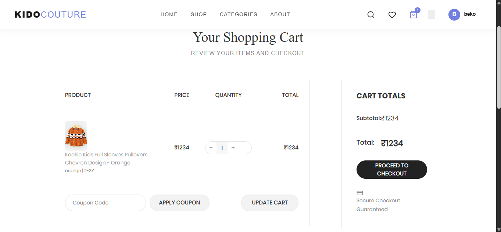

# 👗 Kido Couture - Premium E-commerce Platform

🌐 Live Demo: https://kido-couture-react.vercel.app

Kido Couture is a high-performance, full-stack e-commerce application designed for a premium clothing experience. It features a robust **Django** backend and a dynamic, high-speed **React (Vite)** frontend.

---

## 🚀 Features

- **⚡ Modern Frontend**: Built with React 19 + Vite for sub-second page loads and smooth transitions.
- **🛡️ Secure Auth**: Session-based authentication with Django, including CSRF protection.
- **🛒 Dynamic Shopping**: Add to cart, wishlist functionality, and real-time cart updates.
- **💳 Payment Integration**: Fully integrated with **Razorpay** for secure online payments.
- **📦 Order Management**: Complete checkout flow, order tracking, and invoice generation.
- **🎨 Premium UI**: Featuring Framer Motion animations, Lucide icons, and a glassmorphism design.

---

## 🛠️ Tech Stack

**Frontend:**
- React.js (Vite)
- Framer Motion (Animations)
- Lucide React (Icons)
- Vanilla CSS (Custom Premium Styles)

**Backend:**
- Python 3.x
- Django (Web Framework)
- Django Rest Framework (API)
- SQLite/PostgreSQL (Database)
- Razorpay SDK (Payments)

---

## ⚙️ Installation & Setup

### 1. Clone the repository
```bash
git clone https://github.com/saranyakharidas/kido-couture-react.git
cd kido-couture-react
```

### 2. Backend Setup (Django)
```bash
# Create a virtual environment
python -m venv venv
# On Windows:
venv\Scripts\activate
# On macOS/Linux:
# source venv/bin/activate

# Install dependencies
pip install -r requirement.txt

# Run migrations
python manage.py migrate

# Start the server
python manage.py runserver
```

### 3. Frontend Setup (React)
```bash
cd frontend

# Install packages
npm install

# Start development server
npm run dev
```

---

## 📁 Project Structure

- `/authentications`: User login, signup, and profile logic.
- `/products`: Product catalog, categories, and inventory management.
- `/cart`: Shopping cart and wishlist logic.
- `/userorder`: Checkout, payment processing, and order history.
- `/frontend`: Modern React source code, components, and assets.

---

## 📄 License
Internal use only for Kido Couture.

## 📸 Preview



